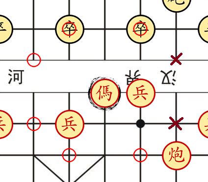

# 2 Players Chinese Chess

As in Western chess, the object of Chinese chess is to capture the opponent’s king (also called general in Chinese chess), and each player starts with 
an army of 16 pieces (one side traditionally red, which moves first, and the other black) on opposite sides of a game board. While the game boards appear 
superficially similar—the Western board is 8 × 8, and the Chinese board is 8 × 8 with an extra horizontal void, known as a river, between the two halves—they 
represent quite different battlefields. Unlike Western chess, which is played on the 64 two-toned squares, Chinese chess is played on the intersection of 
the lines, known as points, that form the squares. This pattern was familiar to the Chinese from the game of go, which was well known before chess arrived 
from India. Thus, Chinese chess is actually played on a 9 × 10 board, or 90 points, rather than 64 squares. In addition, two special regions of nine points, 
known as the red palace and the black palace, are marked off by diagonal lines in the middle along each edge near the players. Each king, together with two 
accompanying mandarins (advisers, assistants, scholars, or guards), is restricted to its own palace.

## Description


The pieces are arranged symmetrically, as shown above. Note that some pieces on the Red side bear different characters than their counterparts on the Black 
side. They are the same pieces — with the same power — on each side. But names on the Red side are subtly more noble than those on the Black side. It’s a 
fair match, but you could say the Reds are the “good guys.” The set you play on may have slightly more or less variation between the two sides, and may be 
of colors other than Red and Black. Not to worry; it’s still the same game.

## Getting Started

### Dependencies

To be able to use the program, you should install the following modules:

```
pip install pygame
```

### Installing

To download this program, enter the following command in your terminal:
```
git clone https://github.com/erichoangnle/chinese_chess.git
```

## Objective

The object of this game is to force capture of the enemy Governor/General (King). This may be by checkmate (he is under attack and has no means of escape) 
or by stalemate (he is not under immediate threat, but there is no legal, safe move).

### Soldier


The Foot Soldier moves one point forward. After it crosses the river, it may also move to the right and left, but never backward. Unlike the pawn in western chess, this piece captures just as it moves normally (see diagram). It does not promote upon reaching the far end of the board.

### The General


The Governor/General moves one space at a time left, right, forward or backward. He is confined to the nine point fortress, on his side of the board.

### Advisor


The Advisor is also confined to the fortress. He moves one point diagonally.

### Elephant


The Minister/Elephant moves exactly two points in any diagonal direction. This piece can be blocked by another piece on the intervening 
square (A and B in diagram) and is not allowed to cross the river, which runs between the two sides of the board.

### Horse



The Horse moves first one point along the horizontal/vertical lines, and then one point diagonally. Similar to the knight in western 
chess, but this horse can be blocked by an intervening piece. The horse in the diagram can not move to the points marked by the red X’s; 
it is blocked by the Black pawn

### Chariot


The Chariot moves exactly like the rook in western chess: as many spaces as it wishes horizontally or vertically, until it meets another 
piece or the edge of the board.

### Cannon


The Cannon/Catapult is a peculiar piece. It moves exactly like the Chariot (or rook) when not capturing. But to capture, it must have a piece, 
friend or foe, in line to jump over. In this diagram, the Cannon/Catapult can capture the enemy pawn, as shown. It can not, however, move 
beyond that pawn, or to the unoccupied marked by X's.

## Additional Rules

When the Governor/General (King) is being threatened with capture, he is said to be in “check,” and the player must move in such a way that the 
Governor/General is no longer threatened. If he can not, he has lost the game.

It is not allowed to give perpetual check, or a perpetual attack. If the game is repeating its position, the player forcing the repetition must 
do something else.

There is a special rule about the Governors/Generals. The two may never face each other on the same line across the board, with no intervening 
pieces between them. It is said that they may not “see” each other. This becomes important, especially in the end game, as the position of one 
Governor/General limits the movements of the other, and can “protect” a piece invading the enemy fortress.

The River, which creates a space between the two sides of the board, is generally ignored — as if it were filled in with lines, completing a 
board of 9 x 10 points. It only effects the moves of the Elephants, who can not cross it, and the Foot Soldiers, who gain more power of move 
after crossing it.

## Contact

Email: erichoangnle@gmail.com

Facebook: https://www.facebook.com/eric.le.520900

Project link: https://github.com/erichoangnle/diary.git
